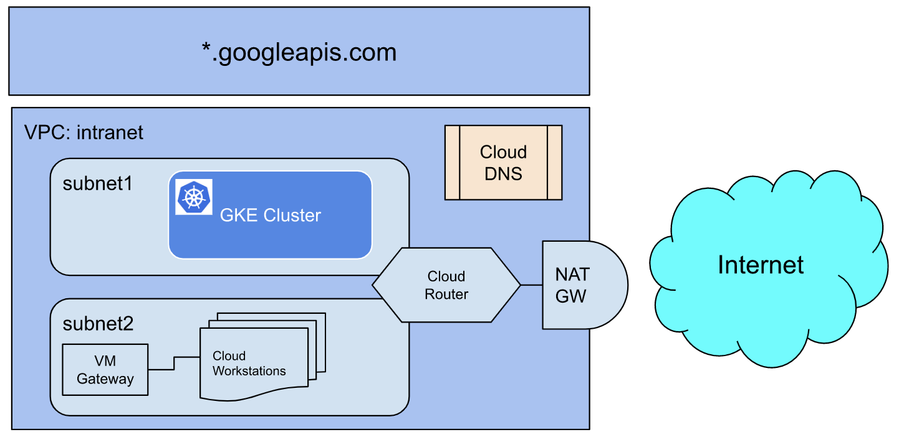

# Create Lab with Terraform
These terraform scripts can be used to quickly create this qwiklab's environment. The following diagram depicted the topology.
* A private VPC with 2 subnets, subnet-1 and subnet-2.
* 3 CloudDNS private zones for pkg.dev, gcr.io, and googleapis.com. *.googleapis.com has been pre-configured to map to private.googleapis.com.
* GKE cluster in one of the intranet VPC, subnet-1
* A pre-configured setting for further creating developer workstation. The resulting workstation would be in the intranet VPC, subnet-2.
* Cloud router & NAT Gateway which allows VPC to egress to internet

*Qwiklabs Topology Diagram created from terraform scripts*
